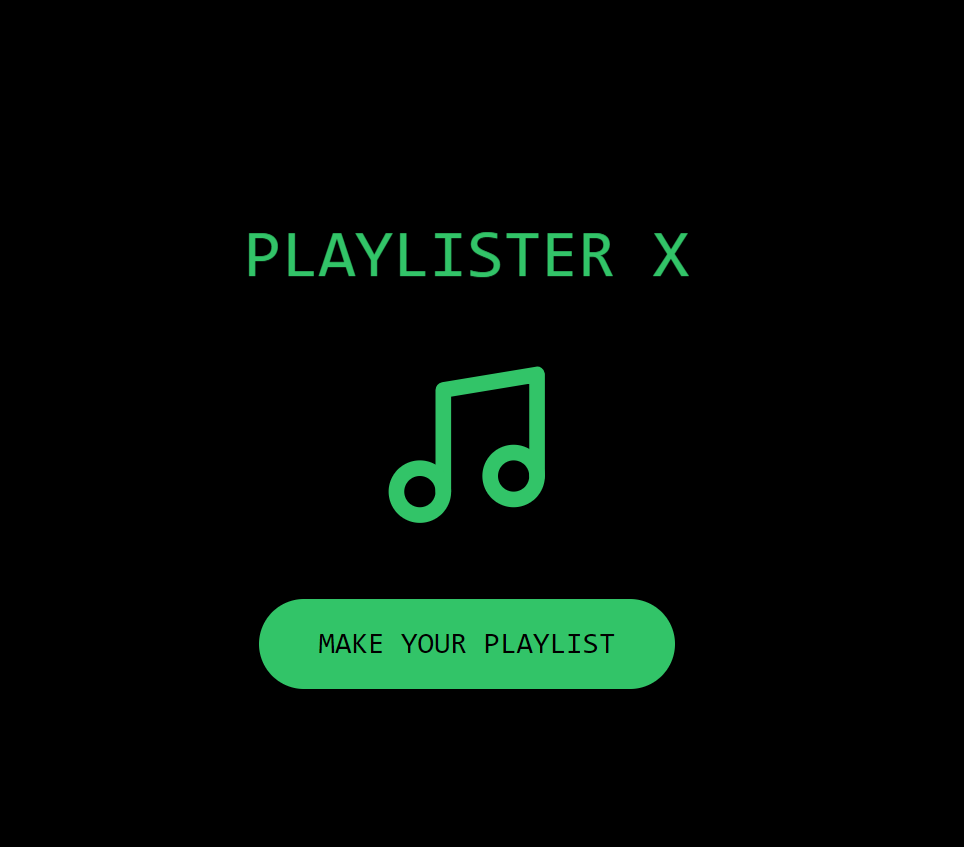
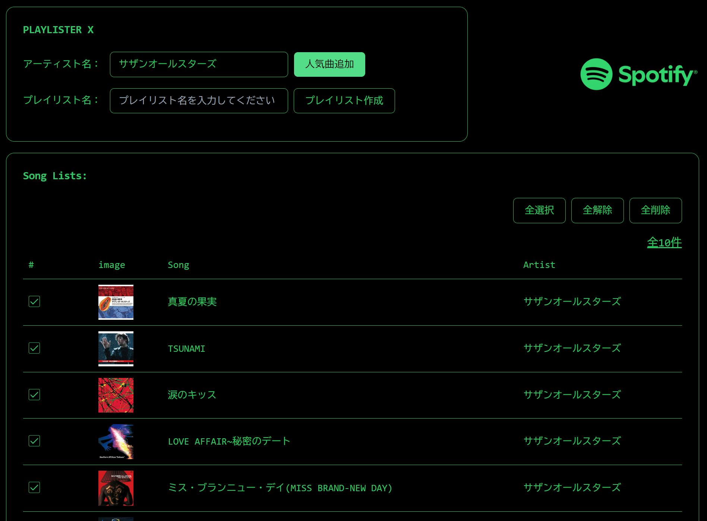

# top-tracks-festival-playlist

SpotifyAPI を使用して、プレイリストを作成します。
https://playlister-x.vercel.app/

# プレイリスト作成

1. ログイン画面

   下記の画面から「MAKE YOUR PLAYLIST」ボタンを押下して、Spotify の権限確認の画面に遷移します。そこで権限の許可をしてください。
   

2. メイン画面

   アーティスト名で検索を行うと、人気曲 TOP10 曲が追加されます。この追加された曲に対して、プレイリスト名を入力してプレイリストを作成します。（チェックがついている曲だけが対象です）
   
